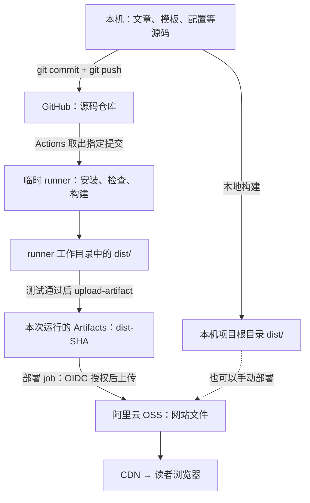

# 从写文章到网站上线：这个 Astro 博客是怎样工作的

写给第一次接触 npm、GitHub Actions 和静态网站的博客作者。  
更新日期：2026-09-17；内容依据本项目当前代码与工作流。OSS 与 CDN 已完成部署验收，日常操作见[部署运维清单](DEPLOYMENT_CHECKLIST.md)。

**你的理解是对的：对这个博客，完成构建后，部署的主要内容就是把项目根目录下 dist 文件夹里的全部文件，上传到配置好的网站托管位置。**

你不必在阿里云服务器上再运行 Astro，也不必为了读者访问而一直开着自己的电脑。这里采用的是“提前生成网页”的静态网站方案。

托管服务还需要域名、HTTPS、目录首页和缓存等基础配置。本项目已完成这些配置，因此，**日常内容更新主要是重新构建、上传文件并验证发布结果。**

先记住这四个词：

| 词 | 在这个博客里是什么意思 |
| --- | --- |
| 源码 / Source | 你编辑的 Markdown 文章、页面模板、样式、游戏代码与配置 |
| 构建 / Build | 运行工具，把源码转换、整理成浏览器可以访问的成品 |
| 产物 / dist | 构建生成的 HTML、CSS、JavaScript、图片、字体等文件 |
| 部署 / Deploy | 把产物放到网站托管服务上，使读者能通过域名访问 |

下面沿着“一篇文章如何到达读者”来解释。第一次阅读重点看第 1、3、5、6、8 节；其他部分可以随用随查。

## 1. 为什么不能把写文章的项目目录直接当网站？

你写的是方便自己维护的材料，浏览器需要的是适合展示的文件。

例如，你新建了一篇文章：

```text
src/content/posts/my-note.md
```

里面是文章标题、日期、标签和 Markdown 正文。浏览器不会仅凭这个文件就知道整个博客应该如何展示导航、文章目录、数学公式、页脚和主题按钮。

本项目会在构建时完成这些事：

- 把 Markdown 内容转换成 HTML。
- 套上统一的文章页面、导航和页脚。
- 处理公式、代码高亮、图片与样式。
- 为文章生成可访问的页面。
- 更新文章列表、标签页、RSS 和 sitemap。
- 整合康威跳棋所需的页面与资源。

这里的 RSS 是供阅读器订阅更新的文件；sitemap 是给搜索引擎看的网址清单。它们也属于构建产物。

最终，这篇文章通常会变成：

```text
dist/posts/my-note/index.html
```

读者访问的则是：

```text
https://nanoka.tv/posts/my-note/
```

托管服务把这个目录网址对应到其中的 index.html。

可以把它理解为：你维护 Markdown 或 LaTeX 源文件，再导出供别人阅读的成品。网站的成品包含许多互相引用的文件，不能只拿走其中一个 HTML。

**因此，修改一篇文章后通常要重新构建整个博客：这篇文章的页面，以及首页、标签页、订阅文件等，都可能需要一起变化。**

Astro 负责组织这种从源码到网页的转换。本项目在 astro.config.mjs 中明确选择了静态输出，并使用“目录内 index.html”的页面形式。[Astro 部署说明](https://docs.astro.build/en/guides/deploy/)

## 2. “静态网站”为什么还能切换主题、复制公式、玩游戏？

“静态”描述的是服务器如何提供页面。

本站在发布之前就已经把页面生成好了。读者打开网页时，服务器主要负责把现成文件发送过去，不需要每次都现场运行 Astro 来生成文章。

但发送给浏览器的文件里可以包含 JavaScript。浏览器拿到它之后，仍然可以执行交互逻辑：

| 功能 | 主要发生在哪里 |
| --- | --- |
| Markdown 转 HTML、生成文章列表 | 构建时，在本机或 GitHub 的构建机器上 |
| 显示文章、排版、加载图片 | 读者浏览器 |
| 切换明暗主题、点击复制按钮 | 读者浏览器 |
| 康威跳棋的棋盘逻辑、点击操作和音效 | 读者浏览器 |

所以静态网站可以有丰富交互。你现在的游戏不要求服务器为每次落子运行一个后端程序。

以后如果增加账户登录、跨设备保存数据、自己托管的评论系统等，可能需要额外后端或第三方服务；**“只上传 dist”适用于当前这个博客的架构**，不是所有 Astro 网站的通用结论。

## 3. Node.js 和 npm 是干什么的？

### Node.js：运行构建工具的环境

JavaScript 不仅能在浏览器中运行，也能通过 Node.js 在电脑上运行。

Astro、项目里的构建脚本以及不少检查工具，都需要 Node.js。这个项目要求 Node.js 24 或以上，当前 CI 使用 24，本地也建议使用同一主版本。

对当前部署方案来说，Node.js 是“制作网站成品时的工具”。读者无需安装它，OSS 也无需替你长期运行它。

### npm：安装工具，并执行项目约定的命令

npm 随常见的 Node.js 安装一起提供。在本站，你主要用它做两件事：

1. 安装这个项目依赖的软件包，比如 Astro。
2. 执行项目中已经定义好的命令，比如预览和构建。

这里的“包 / package”，就是别人已经写好的、可以复用的软件。Astro 本身也是一个包。

下面四样东西可以对应起来：

| 文件或目录 | 作用 | 是否放进 GitHub 源码仓库 |
| --- | --- | --- |
| package.json | 项目的依赖清单、版本要求和命令表 | 是 |
| package-lock.json | 锁定直接与间接依赖的具体版本、关系和校验信息 | 是 |
| node_modules/ | npm 实际下载并安装出来的依赖文件 | 否，本项目忽略它 |
| dist/ | 使用这些工具构建出来的网站成品 | 否，本项目忽略它 |

**依赖还会依赖其他包。** 所以你可能从来没主动使用 @emnapi/runtime，但它仍会出现在完整依赖关系中。它是某个工具需要的间接依赖。

浏览器最终需要的第三方代码会按构建规则进入 dist 的相应文件；这不意味着需要把整套 node_modules 都上传到服务器。

### 常见命令分别做什么？

| 命令 | 通俗解释 | 是否直接更新线上网站 |
| --- | --- | --- |
| npm ci | 严格按照锁文件安装依赖 | 否 |
| npm run dev | 启动本地开发预览，方便边改边看 | 否 |
| npm run check | 检查代码、页面与文章数据是否符合要求 | 否 |
| npm test | 运行项目的自动化测试 | 否 |
| npm run build | 生成本地 dist，供检查和预览 | 否 |
| npm run build:release | 按正式发布要求构建 dist | 否 |
| npm run preview | 在本地查看已经生成的 dist | 否 |
| npm run test:browser | 用自动控制的浏览器测试页面和交互 | 否 |

npm run 后面的名字来自 package.json 的 scripts。例如，项目把 build 定义成“准备游戏资源 → Astro 构建 → 检查产物”，所以执行一条命令就会依次做完这些工作。build:release 则在此基础上要求配置有效的生产域名。

这些名称是项目约定，并非所有 npm 项目都拥有相同的命令。

### npm install 和 npm ci 有什么区别？

日常需要安装、添加或调整依赖时，npm install 可以更新锁文件。npm ci 更严格：它要求现有依赖清单和锁文件已经一致，并按锁安装，不会自动修正锁文件；已有 node_modules 会被重新安装。[npm ci 官方说明](https://docs.npmjs.com/cli/v11/commands/npm-ci/)

在自动构建中采用 npm ci，是为了让问题直接显现，避免机器在你不知情的情况下修改依赖选择。

例如锁文件漏记了依赖，就会发生：

```text
项目需要两个间接依赖
        ↓
锁文件里没有完整记录
        ↓
npm ci 停止
        ↓
后面的检查和构建都没有执行
```

修复方式是补全并提交锁文件。不能把“GitHub 仓库里已有代码”当成“已经成功构建”。

写文章通常不需要修改 package.json 或 package-lock.json。只有依赖发生变化或锁文件确有问题时，才需要处理它们。

## 4. CI 是什么？为什么还要让 GitHub 再构建一次？

CI 是 Continuous Integration，中文通常叫“持续集成”。对你的个人博客，可以先理解为：

> 每次提交更新后，自动检查这个版本能否正常安装、通过测试，并生成网站。

**CI 是一个流程；npm ci 只是这个流程中用于安装依赖的一条命令。** 运行 npm ci 本身，不会自动把整套测试和构建都执行一遍。

自动 CI 并不是静态网站能够上线的必备条件。你完全可以：

```text
自己在本机安装依赖 → 检查 → 构建 → 手动上传 dist
```

引入 CI 的价值，是把这些重复工作写成固定步骤，交给机器执行：

| 经常遇到的情况 | CI 能帮助什么 |
| --- | --- |
| 改完文章，忘了检查某个页面 | 每次都运行已经配置的检查 |
| 本机装过很多依赖，碰巧能用 | 在新的构建环境中重新安装，暴露缺失记录 |
| 修改了样式或游戏，不知道是否影响其他页面 | 自动运行已有的回归测试 |
| 想知道“哪个版本构建成功了” | 每次运行与一次代码提交对应，保留结果与日志 |
| 想拿到这次检查通过的网站成品 | 将同次构建生成的 dist 保存为 artifact |

CI 只能检查我们已经写入规则和测试的内容，不能证明所有问题都不存在。页面审美、文章内容是否准确等，仍需要你看一眼。

本地预览和 CI 可以同时存在：本地预览提供即时反馈，CI 在提交后提供一次统一检查。你不必每次都在本机手动完整重复 CI；可以根据改动大小选择本地检查范围。

## 5. GitHub Actions 实际上在哪里、怎样运行？

GitHub 是保存代码和版本历史的平台；GitHub Actions 是它提供的自动执行任务功能。

你提交代码以后，GitHub 会按仓库里的工作流文件，在一台构建机器上执行指定命令。这台机器叫 runner。本项目使用 GitHub 提供的 Ubuntu Linux runner，可以把它理解成“GitHub 临时分配来完成这次任务的电脑”。它不是你的 Windows 电脑，也不是阿里云 OSS。[GitHub runner 说明](https://docs.github.com/en/actions/concepts/runners/github-hosted-runners)

本站的任务说明书是：

```text
.github/workflows/ci.yml
```

.yml 是 YAML 文件，适合写有层次的配置。你现在不必掌握它的语法，只需知道它规定了：

- 什么情况下开始运行。
- 用哪种机器和工具版本。
- 依次执行什么步骤。
- 最后保存哪些文件。

当前工作流名称是 Check and build，在 push 到 main、Pull Request 和手动触发时运行。main 是这里的主要代码分支；Pull Request 可以理解为把一组改动交给审核的入口，普通个人更新可以直接沿用你现有的 main 提交方式。

### 当前工作流逐步翻译

| 实际步骤 | 它在做什么 |
| --- | --- |
| actions/checkout | 把这次提交的仓库代码取到 runner 上 |
| actions/setup-node | 准备 Node.js 24 与 npm |
| npm ci | 按锁文件安装构建需要的依赖 |
| npm run check | 检查 Astro、TypeScript 和文章数据 |
| npm test | 测试内容处理、配置工具与游戏逻辑 |
| npm run build:release | 构建游戏和博客，得到正式 dist，并检查生成文件 |
| npx playwright install --with-deps chromium | 给 runner 准备浏览器和系统依赖 |
| npm run test:browser | 用浏览器测试页面、布局、跳转和游戏 |
| actions/upload-artifact | 将 dist 保存到这次 Actions 运行的产物区 |

上述步骤属于 validate job。满足发布条件后，独立 deploy job 才会执行：

| 部署步骤 | 它在做什么 |
| --- | --- |
| 检查 main 版本并下载 artifact | 确认没有重跑过时提交，取得同次验证通过的成品 |
| 检查产物并保存 SHA-256 清单 | 确认目标配置和文件完整性，记录本次发布内容 |
| GitHub OIDC → 阿里云 STS | 为本次任务取得短期上传凭证 |
| scripts/deploy-oss.sh | 先上传资源、后上传 HTML，设置类型和缓存元数据 |
| scripts/verify-deployment.mjs | 用 GET 比对源站及 HTTPS CDN 的内容、状态、缓存和类型 |

main 的 push 只有在 Repository Variable `AUTO_DEPLOY=true` 时才发布。手动运行 main 时，默认勾选的 `dry_run` 只预演上传；取消后才上传并验收。Pull Request 只验证代码与构建。

npx 在这里用于运行项目安装的 Playwright 工具；Playwright 是用代码自动操作浏览器来做测试的工具。

工作流还可能利用 npm 的下载缓存来加速安装。**缓存是下载加速用的，artifact 是保存成果用的，两者用途不同。** 命中缓存仍然要执行 npm ci，缓存也不会修复不完整的锁文件。

### 成功与失败意味着什么？

这些正常步骤是按顺序执行的。前面失败，后面通常就跳过。

因此：

- npm ci 失败：这次没有开始构建。
- build:release 失败：这次不能当成有效发布版本。
- 构建成功但浏览器测试失败：runner 上可能已经有 dist，但本项目正常保存 dist 的步骤会被跳过。
- 所有检查和保存步骤成功：本次运行才有正常保存的网站 artifact。

另一个名为 browser-diagnostics 的 artifact 可能保存浏览器测试失败材料；OSS 上传失败时会保存已脱敏的 oss-upload-diagnostics。这些都是故障诊断材料，不是网站发布文件。deployment-manifest 则是文件校验清单，用于核对发布版本。

**工作流文件存在，只说明配置了这些步骤；是否真的成功执行，要看具体一次运行的结果。** 网站已完成首次发布验收，之后每次更新仍要查看对应运行的结果。

## 6. dist 到底在哪里？GitHub 上为什么找不到这个文件夹？

最容易混淆的是：本地项目、GitHub 代码仓库、runner 和 artifact 存储区，不是同一个地方。



实线路径是当前工作流的发布链路；虚线表示需要时可单独安排的本地手动部署。部署 job 还会验证 OSS 源站与 CDN 返回的内容。

### A. 本地构建的 dist

在你的电脑上执行构建后，文件位于：

```text
J:\NANOKA\N Blog\nnk_blog\dist\
```

这些是真实存在于你硬盘上的文件。修改源码后，它们不会自动因为 git push 而更新；要重新运行构建。

项目里还有游戏子项目的 `apps/conway-soldiers/dist/` 和 `apps/conway-soldiers-3d/dist/`。**发布整个博客时要用 nnk_blog 根目录的 dist，它已包含两个游戏；不用分别发布子项目的 dist。** 源码目录与构建产物的详细关系见[交互作品集成说明](INTERACTIVE_APPS.md)。

### B. GitHub runner 上的 dist

Actions 自己下载源码、安装依赖、运行构建，生成的是 runner 工作目录中的另一份 dist。

它不会从你的电脑自动拿走本地 dist，也不会把云端生成的 dist 自动同步回你的电脑。本机 Windows 和云端 Linux 使用同一份源码与锁文件，目标是得到正确的同版本网站；不要假定不同平台构建的每个字节一定相同。

runner 是临时工作环境。要在任务结束后继续取得构建成果，需要额外保存。这就是 upload-artifact 的用途。

### C. GitHub 保存的 artifact

Artifact 可以直译为“产物”。在这里，它是 GitHub 为一次工作流运行保存的一组文件。

当前配置的名称是：

```text
dist-<这次提交的完整 SHA>
```

SHA 在这里可以理解为一个提交版本的标识。名称中带版本号，就能知道这份成品对应哪次代码提交。

这份 artifact：

- 存放在 **Actions 的具体一次运行详情中**。
- 可以从浏览器下载成压缩包，再解压取出网站文件。
- 本项目设置保留 **14 天**。
- 不会自动成为仓库 Code 页面里的 dist 文件夹。
- 由部署 job 下载后上传阿里云 OSS；保存 artifact 本身不会触发上传，也不会发布到 GitHub Pages 或 Releases。

GitHub 的 artifact 功能就是用于保存与传递工作流生成的文件；本站的 14 天来自 ci.yml 中的 retention-days 配置。[GitHub artifact 说明](https://docs.github.com/en/actions/concepts/workflows-and-actions/workflow-artifacts)

下载方法：

1. 登录具有该仓库读取权限的 GitHub 账号，打开 [Nanoka42/nnk-blog 的 Actions 页面](https://github.com/Nanoka42/nnk-blog/actions)。
2. 打开一次成功的 Check and build 运行，并确认是自己要发布的提交。
3. 在运行详情中找到 Artifacts。
4. 下载 dist-版本号；解压后找到包含 index.html、_astro、posts 等内容的那一层。

不用把下载得到的整个 ZIP 文件直接当网站上传；一般应上传解压后的静态文件。下载步骤可参考 [GitHub 官方说明](https://docs.github.com/en/actions/how-tos/manage-workflow-runs/download-workflow-artifacts)。

### D. 部署到 OSS 后的网站文件

部署 job 使用上传工具，把同次构建产物复制到 OSS Bucket。Bucket 可以理解为云上的一个文件存储容器。

这份文件是线上网站的源站内容。**GitHub artifact 14 天后过期，并不会连带删除已经上传到 OSS 的网站文件。** 两者是独立存储的副本。

反过来，GitHub 上保存了 artifact，也不代表 OSS 已经收到它。

### 为什么不把 dist 提交到 Git 仓库？

本项目的 .gitignore 明确忽略 dist 和 node_modules。仓库保留可维护的源码、配置与锁文件，成品通过构建再生成。

这样能避免每次修改一篇文章都在版本历史中混入大量生成文件，也避免源码和成品分别修改后互相矛盾。你在 GitHub 的 Code 页面看不到 dist，是这套项目的正常设计。

稳定发布版本的 artifact 值得另外归档用于回滚；当前 14 天保留期并不是永久备份。

## 7. 本地开发、构建、预览与正式发布怎么区分？

| 场景 | 常用命令 / 行为 | 面向谁 |
| --- | --- | --- |
| 一边写一边看 | npm run dev | 你自己，本地开发 |
| 生成可以发布的文件 | npm run build:release | 后续检查和部署 |
| 查看刚生成的文件 | npm run preview | 你自己，本地验证 |
| 对外提供访问 | 上传文件到 OSS，配合 CDN 与域名 | 读者 |

开发模式通常会随着源码编辑刷新页面，方便你即时查看。preview 查看的是已经构建好的文件，适合确认“成品长什么样”；修改源码后，通常需要重建才能让 preview 看到新成品。

这些本地地址都不是正式网站地址。停止本地预览或关闭电脑，不会影响已经正确部署到 OSS/CDN 的网站。

### 如果要在本机生成一份正式产物

下面是需要时手动执行的示例，不必每次写作都执行完整流程。按顺序逐条执行；如果某条命令报错，先解决它，再继续下一条：

```powershell
Set-Location -LiteralPath 'J:\NANOKA\N Blog\nnk_blog'

npm ci

$env:SITE_URL = 'https://nanoka.tv'
npm run build:release

npm run preview
```

按终端显示的 Local 地址打开预览。此项目会自动选择可用端口，不必死记某个端口号。

停止本地预览不会删除 dist。普通前台运行时可以按 Ctrl+C 停止；如果工具提示服务在后台运行，则按项目 README 中的后台服务说明停止。

这里的 SITE_URL 告诉构建工具：“将来的正式网站网址是什么”。它会影响页面中的规范网址、RSS、sitemap 等内容；**设置这个变量不会购买域名、修改 DNS 或把网站自动上线。**

普通 npm run build 在未设置生产域名时，可以生成适合本地检查的产物，其中可能带有 localhost 与禁止索引标记。真正发布使用 build:release，并确保 SITE_URL 正确。本项目 CI 已通过仓库变量或默认值提供 https://nanoka.tv。

## 8. 后续部署是不是只上传 dist 就可以？

**对网站程序文件来说，是的：上传根目录 dist 内的完整内容即可。**

典型的成品结构如下，文件名会随内容和构建变化：

```text
dist/
├─ index.html
├─ 404.html
├─ about/
│  └─ index.html
├─ posts/
│  ├─ index.html
│  └─ my-note/
│     └─ index.html
├─ projects/
│  ├─ conway-soldiers/
│  │  └─ index.html
│  └─ conway-soldiers-3d/
│     └─ index.html
├─ play/
│  ├─ conway-soldiers/
│  │  ├─ index.html（兼容跳转）
│  │  ├─ src/
│  │  ├─ icons/
│  │  └─ sounds/
│  └─ conway-soldiers-3d/
│     ├─ index.html（兼容跳转）
│     ├─ src/
│     └─ sounds/
├─ _astro/
│  └─ 构建生成的样式、脚本、图片等
├─ rss.xml
├─ robots.txt
└─ sitemap 等文件
```

以网站放在域名根路径为例，映射应当是：

| 本地或 artifact 中的文件 | OSS 对象路径 | 网站访问方式 |
| --- | --- | --- |
| dist/index.html | index.html | https://nanoka.tv/ |
| dist/about/index.html | about/index.html | https://nanoka.tv/about/ |
| dist/posts/my-note/index.html | posts/my-note/index.html | https://nanoka.tv/posts/my-note/ |
| dist/_astro/某个资源 | _astro/某个资源 | 页面自动加载它 |

重点是把 **dist 里面的内容**放到网站根目录，而不是额外加一层 dist，变成线上 dist/index.html。也不能只传 HTML，遗漏它引用的样式、字体、图片和游戏资源。

不需要上传源码目录、node_modules、.git、.env、测试报告。Astro 模板和构建脚本已经完成了它们的工作；源代码仍应保存在 Git 仓库中，用于以后修改。

### 云端基础配置决定“这些文件如何被访问”

本项目已配置 OSS/CDN 处理以下行为：

- 用户访问 / 时，应返回 index.html。
- 用户访问 /posts/my-note/ 时，应找到该目录的 index.html。
- 不存在的网址，应返回正确的 404 页面和状态。
- 域名如何指向 CDN，HTTPS 证书如何配置。
- 文件采用正确的类型与缓存设置。

所以“只需要静态文件”描述的是应用的运行需求，**并不表示随便找个云盘上传后就能自动拥有完整的网站访问方式**。

日常更新已经可以简化为：

```text
取得通过检查的新 dist
        ↓
上传 / 更新 OSS 中的网站文件
        ↓
等待 CDN 短缓存到期，必要时手动刷新
        ↓
自动验收源站与 CDN，再浏览确认
```

CDN 会缓存文件的副本；缓存没有到期或刷新前，读者可能暂时看到旧内容。构建成功、上传成功和读者看到新内容，是需要分别确认的状态。

如果只做覆盖上传，已经删除的文章可能仍残留在 OSS。删除文章与清理旧资源需要部署流程明确处理；这一点不会因为新 dist 中不再有该文件就自动解决。

## 9. “自动构建”和“自动部署”为什么不是一回事？

当前工作流同时实现了构建与部署，但它们仍然是独立阶段：

```text
push 到 main，且 AUTO_DEPLOY=true
   ↓
自动安装、检查、测试
   ↓
自动构建
   ↓
自动保存 artifact
   ↓
部署 job 下载这次通过检查的 artifact
   ↓
取得有上传权限的阿里云临时凭证
   ↓
把文件上传到指定 OSS Bucket
   ↓
验证 OSS 源站，再等待短缓存并验证 HTTPS CDN
```

GitHub 需要明确的上传目标、权限和部署步骤才能写入云服务。本项目将目标配置放在 production Environment Variables 中，通过 OIDC 获取临时权限，并在独立部署 job 中使用。

CI 主要对应持续检查和验证；CD 常用来描述持续交付 / 持续部署。你目前不必记住所有术语，区分“自动做好成品”和“自动把成品发布出去”即可。

这些状态之间没有等号：

```text
代码已 push
  ≠ 检查已经通过
  ≠ dist 已经生成
  ≠ artifact 已经保存
  ≠ 文件已经上传 OSS
  ≠ 读者已经看到新页面
```

**Actions 出现绿色勾，说明这一轮实际执行的工作完成了。** 还要看 deploy job 是否运行、是否为 dry run：只有真实部署及源站、CDN 验收全部通过，才表示这一轮完成了发布。PR、暂停自动发布时的 main push，以及手动预演都可以成功而不更新网站。

## 10. 以后日常发文章，你需要做什么？

### 自动发布开启时

Repository Variable `AUTO_DEPLOY=true` 时，通常只需关心以下过程：

1. 在 src/content/posts 中写或修改 Markdown 文章，并添加相关图片。
2. 需要时用 npm run dev 看一眼效果。
3. 用 Git 提交并 push 到 main。
4. 等 GitHub Actions 检查、构建和部署成功。
5. 打开正式网站确认文章、图片和链接正常。

你不必每次手工安装整个构建环境、管理服务器进程、下载 artifact 再上传，这些步骤已由工作流处理。

### 暂停自动发布或手动预演

将 Repository Variable `AUTO_DEPLOY` 设为 `false`，main push 仍会检查并保存 artifact，但不会上传。需要发布时，在 Actions → Check and build → Run workflow 中选择 main，并取消 `dry_run`；保留勾选则只预演上传，不改变 OSS。恢复 `AUTO_DEPLOY=true` 后，后续 main push 会恢复自动发布。

如果 Actions 失败，先看**第一个失败的步骤**，不要被后续“跳过”的步骤分散注意力：

| 第一个失败步骤 | 通常属于哪类问题 |
| --- | --- |
| npm ci | 依赖清单、锁文件、下载或安装环境 |
| check | 类型、页面代码或文章字段 |
| test | 已有程序逻辑不符合测试预期 |
| build:release | 无法生成页面、生产域名不正确、产物校验失败等 |
| test:browser | 页面、跳转或交互在浏览器中不符合预期 |
| upload-artifact | 产物路径、上传或 GitHub 服务等问题 |
| OSS 上传 | 云权限、上传目标、网络或部署脚本；查看已脱敏的失败报告 |
| OSS / CDN 验收 | TLS、DNS、网络、缓存，或线上文件与本次 artifact 不一致 |

这些是排查方向，不是看到步骤名字就能断定具体原因。需要协助时，提供失败步骤名称和报错末尾几段即可，不需要先学会整个前端工具链。

## 11. 几个实用问题

**只修改了一句话，也要重新构建吗？**  
需要生成包含新文字的网页，才能发布。通过 CI 自动做这件事后，你通常只需要提交源码更新。

**是不是每写一篇文章都要运行 npm ci？**  
通常不用。首次在一台电脑准备项目，或依赖清单 / 锁文件变化时需要安装依赖；日常修改文章可以直接使用已经准备好的本地环境。GitHub 的新 runner 则会按流程重新安装。

**能直接编辑 dist 里的 HTML 吗？**  
技术上能，但它是生成文件，下次构建会覆盖。长期维护应修改文章或模板，再重新构建，否则修改不会可靠地留在源码历史里。

**Actions 构建失败，已经在线的网站会立刻坏掉吗？**  
不会仅仅因为构建失败而变化。部署 job 只在检查成功后运行；如果还没有开始上传，线上仍然是上一份已部署内容。上传过程中失败可能已经更新部分文件，应查看失败报告并重新发布完整版本；回滚方法见部署运维清单。

**artifact 过期了，源码也会消失吗？**  
不会。Git 仓库源码、Actions artifact、OSS 网站文件是分开的。artifact 过期后无法再下载那一份文件；源码仍可用于重新构建，但若要精确恢复某次历史发布，保留当时的完整成品更可靠。

**需要购买一台 VPS 或 ECS 吗？**  
当前方案不需要专门购买虚拟机来运行博客程序。OSS 提供文件存储和访问，CDN 提供分发与 HTTPS，已经能承担此静态站点的托管工作。

**这份说明会作为一篇博客文章发布吗？**  
不会。本文件位于项目的 docs 目录，是项目使用说明；当前构建不会把整个 docs 自动作为文章发布。

## 12. 在项目中继续查哪里

| 想做的事 | 对应位置 |
| --- | --- |
| 查看 npm 命令的具体定义 | package.json 的 scripts |
| 查看自动检查、构建与部署步骤 | .github/workflows/ci.yml |
| 修改文章 | src/content/posts/ |
| 理解文章格式、图片、数学写法 | docs/CONTENT_GUIDE.md |
| 查看生成的网站成品 | 项目根目录 dist/ |
| 日常发布、排错与回滚 | [部署运维清单](DEPLOYMENT_CHECKLIST.md) |
| 了解或重建阿里云配置 | [阿里云部署指南](DEPLOYMENT_GUIDE.md) |
| 查每次云端执行结果、下载成品 | GitHub → Actions → 对应运行 → 日志 / Artifacts |

你日常主要维护文章和素材；构建工具负责将它们整理成网站；CI 负责自动检查并制作成品；部署负责把成品送到 OSS；CDN 再将这些文件提供给读者。
